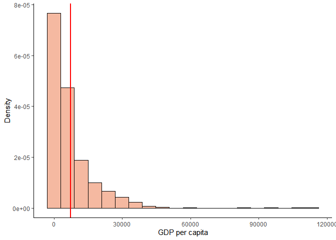

<!-- README.md is generated from README.Rmd. Please edit that file -->

# graph

The `graph` package was created to complete the [Assignment
B-2](https://stat545.stat.ubc.ca/assignments/assignment-b2/), for the
[STAT545b 2021 course](https://stat545.stat.ubc.ca/).

## Overview

`graph` is a package based in ggplot2 developed to facilitate the
creation of histograms to explore the distribution variables. The
function `histogram()` displays the distribution of a single numeric
variable through a histogram.

## Installation

graph is not yet on CRAN. can install the package from GitHub using the
following code:

``` r
devtools::install_github("cataralina/graph")
```

## Usage

The package have one function that displays the distribution of a single
numeric variable through a histogram:

-   `histogram()`

You start with `histogram()`, supply a dataset and the numeric variable
to plot. Information about the xlab tittle, the number of bins and what
to do with the NA is optional, but you can specify it using:

-   `xlab = "title"`  
-   `bins =` number of bins (defaults to **30**)  
-   `na.rm =` A logical vector indicating whether NA values should be
    stripped before the computation proceeds. **TRUE** is the default.

## Example

``` r
library(graph)
library(gapminder)
```

``` r
histogram(gapminder, lifeExp)
```


``` r
histogram(gapminder, lifeExp, xlab = "Life Expectancy")
```


``` r
histogram(gapminder, gdpPercap, xlab = "GDP per capita", bins = 20)
```


